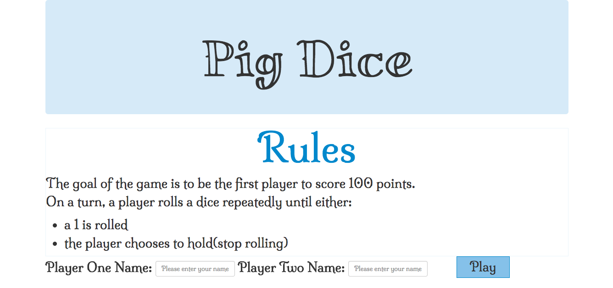
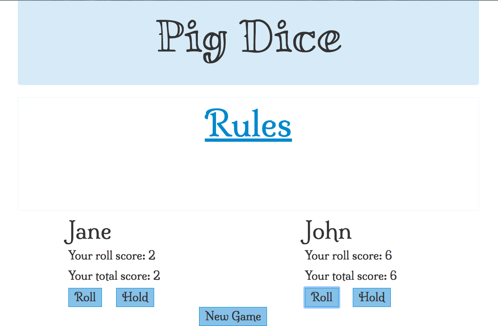
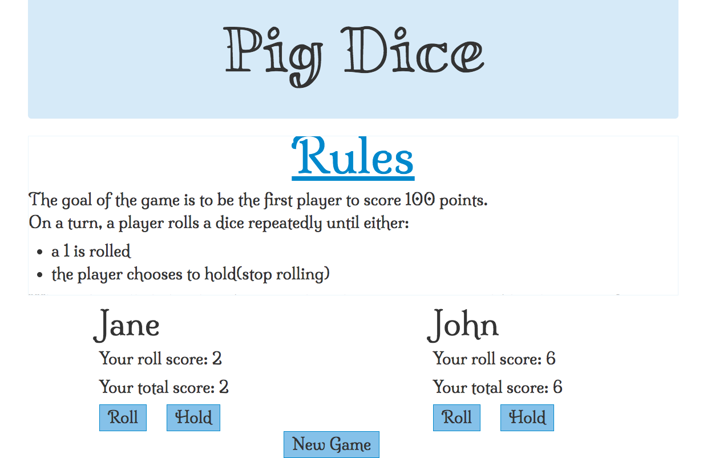

# Pig Dice

## This is a web application where 2 users can play Pig Dice against each other, 25/08/2017 

## By **[Carol Wanjohi](https://github.com/carolwanjohi)**

## Description

[This](https://carolwanjohi.github.io/pig-dice/) is a web application where 2 users can play Pig Dice against each other. The goal of the game is to be the first player to score 100 points.

On a turn, a player rolls a dice repeatedly until either:
* a 1 is rolled  
  or  
* the player chooses to hold(stop rolling)

When a 1 is rolled, the player's turn ends and no points are scored (the player gets 0 points).

If the player chooses to hold, all their points are added to his or her score.

The game ends when a player reaches a total of 100 or more points. This player becomes the winner.

## How Pig Dice Works
| Behavior        | Input           | Outcome  |
| ------------- |:-------------:| -----:|
| The program should display the inputted name of the two players when the Play button is clicked | Player 1 : John Player 2 : Jane| John Jane |
| Player 1 can roll the dice and their result is displayed as a score | Click Roll button | Roll : 4 Score: 4 |
| Player 1 can hold the dice and their current score is retained | Click Hold button | Roll : 4 Score: 4 |
| Player 2 can roll the dice and their result is displayed as a score | Click Roll button | Roll : 6 Score: 6 |
| Player 2 can hold the dice and their current score is retained | Click Hold button | Roll : 6 Score: 6 |
| If a player's roll is 1, their current score will revert to 0 | Click Roll button | Roll : 1 Score : 0 |
| The program alerts the players of the winner | Score : x => 100 | Player1 / Player2 is the winner |

## Setup/Installation Requirements

* Click [Pig Dice](https://carolwanjohi.github.io/pig-dice/)  
  or  
* Copy [Pig Dice](https://carolwanjohi.github.io/pig-dice/) and  Paste the link at your prefered browerser

This requires internet connection

## Known Bugs

No known bugs

## Technologies Used

- HTML
- CSS
- JAVASCRIPT
- BOOTSTRAP
- JQUERY

### License

MIT (c) 2017 **[Carol Wanjohi](https://github.com/carolwanjohi)**
